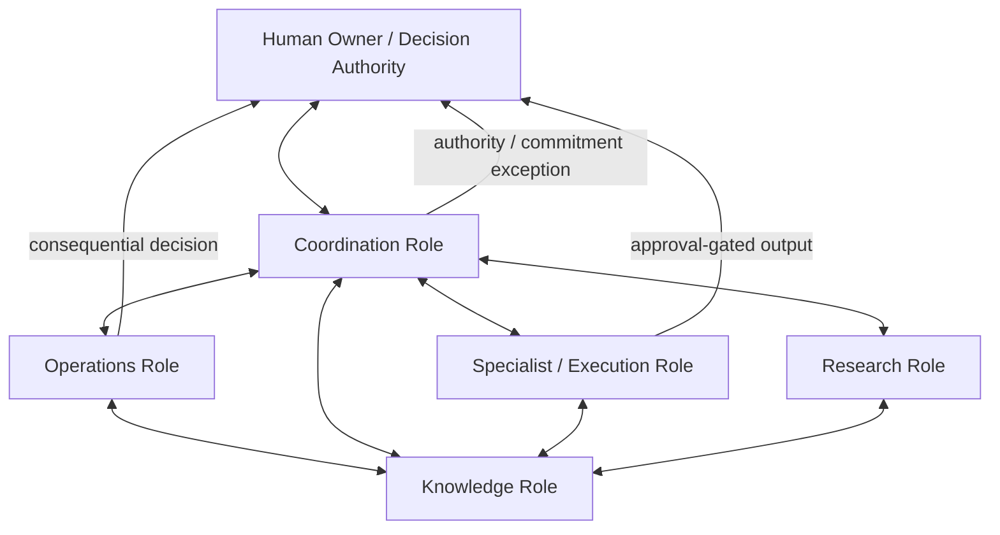
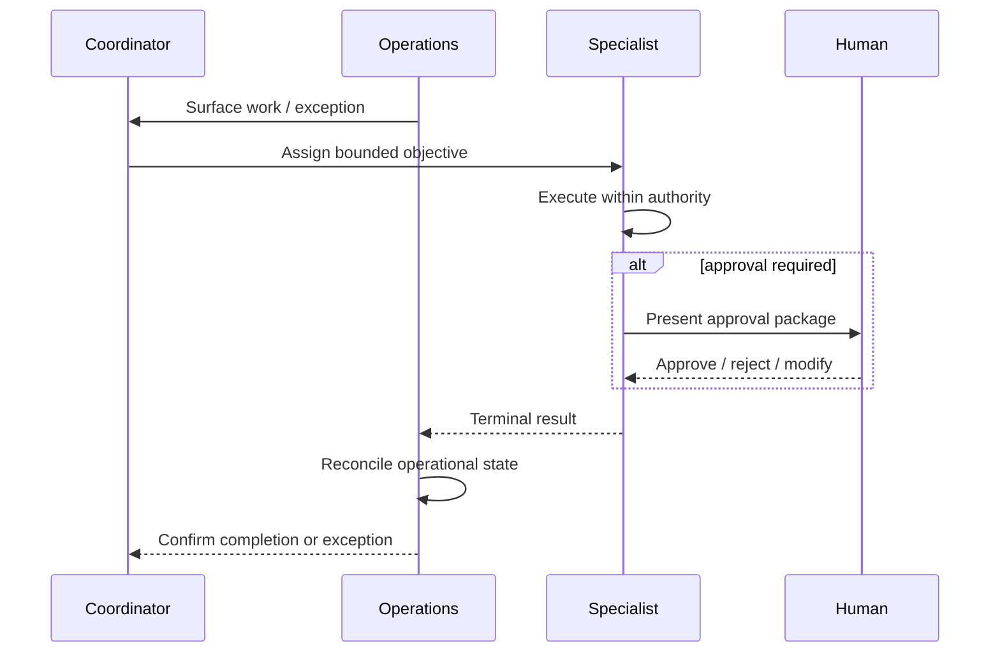

# Multi-Agent Operations Architecture

A sanitized case study of a role-based multi-agent architecture designed for practical business operations.

## The Problem

A single general-purpose AI assistant can perform many tasks, but operational use becomes difficult when the same system is expected to prioritize work, execute routine processes, perform research, manage knowledge, coordinate other functions, and decide when a human should intervene.

The issue is not simply model capability. It is **operational responsibility**.

This architecture explores a different approach: specialized AI roles with explicit responsibilities, bounded authority, defined handoffs, shared operational state, and human escalation.

## Architecture



The diagram shows communication paths, not unlimited command authority.

## Role Model

### Coordination

Maintains priorities, cross-functional alignment, ownership, and exception handling.

It should answer:

- What matters now?
- Who owns it?
- Is a handoff stalled?
- Does this require human authority?

It does not automatically inherit the execution authority of every specialist it coordinates.

### Operations

Maintains current operational state, detects actionable inputs, tracks dependencies, and routes exceptions.

This role is concerned with whether work is current, waiting, upcoming, decision-bound, or merely being monitored.

### Specialist / Execution

Performs bounded domain work such as content operations, analysis, documentation, or another defined business function.

A specialist receives authority appropriate to its domain rather than general authority over the organization.

### Research

Investigates questions, develops options, challenges assumptions, and produces recommendations.

Its output can inform a decision without becoming the decision itself.

### Knowledge

Maintains authoritative internal knowledge, provenance, and retrieval.

The knowledge role helps other roles operate from consistent information but should not silently turn historical information into current policy.

## Core Principle

> Specialization does not require authority expansion.

An agent may improve how it performs its assigned role without inventing new organizational authority.

That distinction allows the system to become more capable while keeping consequential control legible.

## Handoff Contract

A handoff should contain enough structure that the receiving role does not need to reconstruct the sender's intent.

```yaml
item_id: stable-id
from_role: operations
to_role: specialist
objective: what must be accomplished
current_state: current operational state
authority: permitted actions
approval_required: true | false
dependencies:
  - known dependency
completion_signal: observable terminal condition
escalation_condition: condition requiring human or coordinator review
```

## Authority Model

Authority is based on role and action type, not model confidence.

A practical implementation can distinguish:

| Level | Meaning |
| --- | --- |
| **Observe** | Read, inspect, classify, or monitor |
| **Recommend** | Produce analysis or a proposed action |
| **Execute Bounded** | Perform a predefined reversible/routine action |
| **Execute With Approval** | Prepare action but require a human gate |
| **Human Only** | Consequential judgment or commitment remains human |

Repeated approval does not automatically promote an action into a higher authority level.

## Shared State Without Shared Identity

Agents may need access to common operational facts, but they do not need to become interchangeable.

Shared state can include:

- active work;
- dependencies;
- approved policies;
- terminal results;
- verified knowledge; and
- escalation status.

Role-specific instructions remain separate.

This reduces cross-role contamination and makes it easier to identify which component produced an error.

## Handoff Lifecycle



## Failure Modes

### Role Bleed

One agent begins performing another role's responsibilities because it has access to related information.

**Control:** explicit role boundaries and routing rather than capability-based authority.

### Authority Drift

An agent assumes that previous human approvals establish standing permission.

**Control:** authority changes require explicit policy changes.

### Lost Handoff

The sender considers work transferred while the receiver never owns or completes it.

**Control:** stable item identity, explicit receiving owner, and observable completion signal.

### Split-Brain State

Two agents hold conflicting beliefs about whether work is pending or complete.

**Control:** authoritative terminal signals and reconciliation against shared operational state.

### Human Bottleneck

Every uncertainty is escalated, defeating the purpose of automation.

**Control:** define routine in-authority work clearly enough to proceed without unnecessary approval.

### Uncontrolled Autonomy

Agents recursively delegate or take external actions without bounded scope.

**Control:** delegation does not grant new authority; external commitments follow explicit action contracts.

## Why Not One Agent?

A single assistant can simulate multiple functions, but operational separation provides useful properties:

1. **Accountability** — failures can be traced to a role or handoff.
2. **Least authority** — each component receives only the authority it needs.
3. **Context control** — domain instructions do not need to contaminate every task.
4. **Independent improvement** — one role can evolve without redefining the whole system.
5. **Clear escalation** — human intervention occurs for known reasons rather than generic uncertainty.

The architecture is less about creating more agents and more about creating **clearer responsibility**.

## Design Lessons

### Organizational design matters in AI systems

Agent capability alone does not create a reliable operating model.

### Handoffs are first-class system components

A correct output can still fail operationally if ownership or state is not transferred correctly.

### Human oversight should be targeted

Humans should retain consequential authority without becoming a manual router for routine work.

### Knowledge and authority are different

Having access to authoritative information does not grant permission to act on behalf of the organization.

### Terminal conditions prevent zombie work

Every recurring or delegated process needs a clear definition of completion, continuation, or escalation.

## Scope

This is a sanitized architecture case study derived from applied AI operations work.

It intentionally omits production prompts, credentials, private business data, customer information, and proprietary internal configuration. Generic role names are used to focus on reusable design patterns rather than internal identities.

---

**William "Billy" VanVorst**  
Applied AI Systems & Automation  
Founder, bVan! Systems
